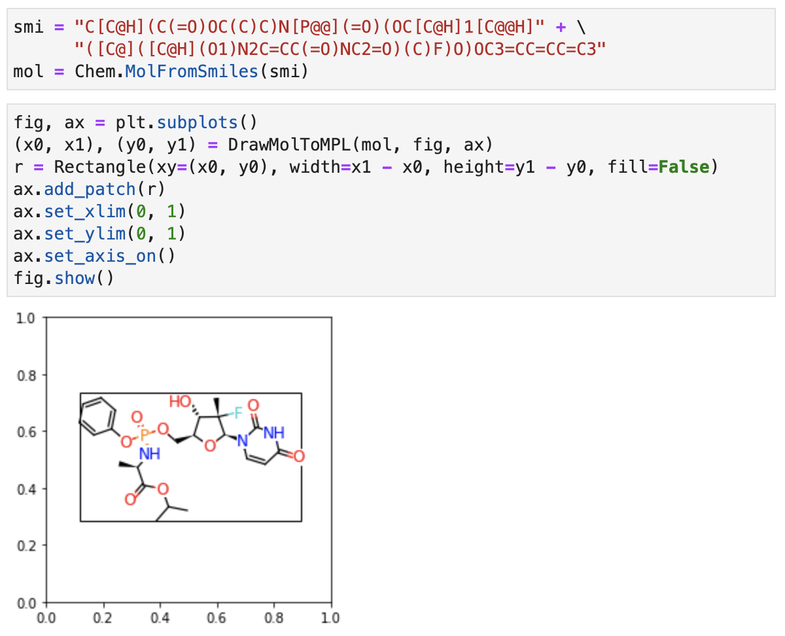

# DrawMolToMPL: RDKit mol drawing with matplotlib

A quickfix for *rdkit.Chem.Draw.MolToMPL* to save drawings as **vector graphics**.


## What is this for?

*DrawMolToMPL* generates a drawing of *rdkit.Chem.rdchem.Mol* objects by matplotlib line graphics, and thus it can be saved as a **vector image**.

I had a problem when I tried to output RDKit molecular graphics into a PDF or EPS file. If I convert it into a PIL image by *rdkit.Chem.Draw.MolToImage* for matplotlib subplots, then the output quality was in a low resolution because it's a pixel image. But, apparently SVG-based drawings (like *rdkit.Chem.Draw.rdMolDraw2D.MolDraw2DSVG*) cannot simply be saved to a PDF file. Furthermore, it cannot work with matplotlib subplots, and it's frustrating when we want to draw many pairs or sets of molecules in a single panel.

*DrawMolToMPL* fixes this issue to work with matplotlib subplots. The following example successfully generates a vector-graphcis output like [out.pdf](out_examples/out.pdf).


*matplotlib.pyplot.subplots* provides flexible and powerful layouts for multiple graphics, and we can enjoy its significant benefit by using *DrawMolToMPL*. Even for a simple grid layout, it can be useful. A RDKit's practice would be something like this


and the output is saved as [PNG](out_examples/rdkit_out.png) (a raster image) or [SVG](out_examples/rdkit_out.svg) (a vector image). To get the output in PDF, it further requires a converter such as rsvg-convert and cairosvg (or Illustrator, Inkscape, etc), which is annoying. Check out [out_examples](out_examples).

```bash
$ cairosvg rdkit_out.svg -o rdkit_cairosvg.pdf
$ rsvg-convert -f pdf -o rdkit_librsvg.pdf rdkit_out.svg
```

## How to use this?

See [example.ipynb](example.ipynb).

## To work with matplotlib subplots


Internally *DrawMolToMPL* draw a molecule in the [0,1]x[0,1] area, and returns (xlim, ylim) representing its bounding box. So you can work using this information as you like.



