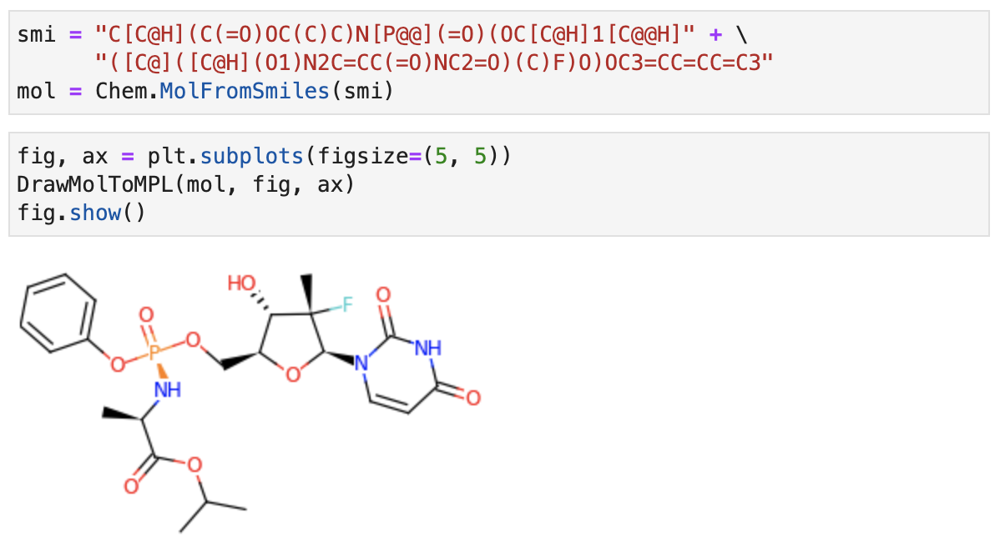

# DrawMolToMPL: Quickfix for RDKit drawing for matplotlib

A quickfix for rdkit.Chem.Draw.MolToMPL to save drawings as **vector graphics**.

## What is this for?

It generates a molecular drawing of RDKit Mol objects in a matplotlib line graphic, and thus it can be saved as a **vector image**.

I had a problem when I tried to output RDKit molecular graphics in a file. If I convert it into a PIL image by *rdkit.Chem.Draw.MolToImage*, then the output quality was in a low resolution because it's a pixel image. But, SVG-based drawings (like *rdkit.Chem.Draw.rdMolDraw2D.MolDraw2DSVG*) cannot simply be saved in a file. In particular, it cannot work with matplotlib subplots. 

## Work with matplotlib subplots

Internally *DrawMolToMPL* draw a molecule in the [0,1]x[0,1] area, and returns (xlim, ylim) representing its bounding box. So you can work using this information as you like.

## TODO

This is a simple quickfix from the original [rdkit.Chem.Draw.MolToMPL](https://github.com/rdkit/rdkit/blob/58e6743df02c004b5c719c044a2641d719a2e7df/rdkit/Chem/Draw/__init__.py#L331), but this one needs further improvements compared to PNG- or SVG-based outputs (i.e. [_moltoimg](https://github.com/rdkit/rdkit/blob/58e6743df02c004b5c719c044a2641d719a2e7df/rdkit/Chem/Draw/__init__.py#L447) or [_moltoSVG](https://github.com/rdkit/rdkit/blob/58e6743df02c004b5c719c044a2641d719a2e7df/rdkit/Chem/Draw/__init__.py#L490))?? 

rdkit.Chem.Draw.MolToMPL just used [rdkit.Chem.Draw.MolDrawing](https://github.com/rdkit/rdkit/blob/58e6743df02c004b5c719c044a2641d719a2e7df/rdkit/Chem/Draw/MolDrawing.py#L77), but _moltoimg or _moltoSVG calls drawMolecule of [rdkit.Chem.Draw.MolDraw2DSVG](https://github.com/rdkit/rdkit/blob/69b143edd059612c2f28ad898fa2d87dc1525e6f/Code/GraphMol/MolDraw2D/MolDraw2DSVG.cpp) or [rdkit.Chem.Draw.MolDraw2DCairo](https://github.com/rdkit/rdkit/blob/69b143edd059612c2f28ad898fa2d87dc1525e6f/Code/GraphMol/MolDraw2D/MolDraw2DCairo.cpp) object that is implemented in C++. Both are subclass of [MolDraw2D](https://github.com/rdkit/rdkit/blob/69b143edd059612c2f28ad898fa2d87dc1525e6f/Code/GraphMol/MolDraw2D/MolDraw2D.cpp) where drawMolecule seemed actually processed.

At least, it would be nice to implement [MolDraw2D::getAtomSymbol](https://github.com/rdkit/rdkit/blob/69b143edd059612c2f28ad898fa2d87dc1525e6f/Code/GraphMol/MolDraw2D/MolDraw2D.cpp#L3991) in *rdkit.Chem.Draw.MolDrawing* to output, for example, NH2 as NH2.

